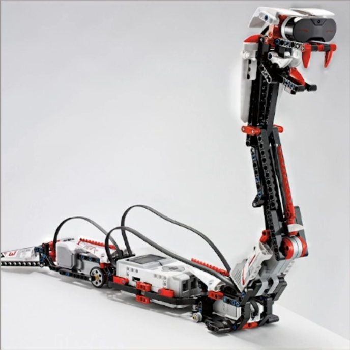

# CS50: AI-Snake
A python program that runs on Lego mindstorm and mimics a real life behavior of a snake. Some of the features of this program are randome tail wiggling with ability to hiss, bite and two operating modes controllerd by remote and autonomous. 

# Technical spicifications: 
* Written in python programming language.
* State design pattern to switch between the modes.
* Multithreading for different behaviors.

# Architecture preview:

    

# Project preview: 

    

## Video demonstration
https://www.youtube.com/watch?v=OiA8ewbjm5E